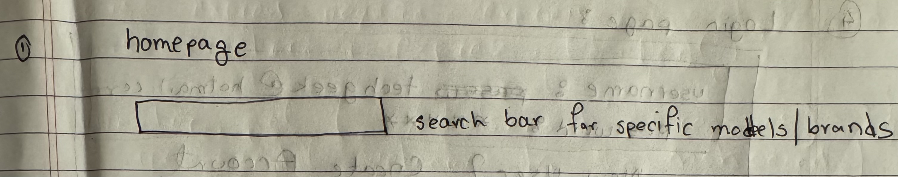
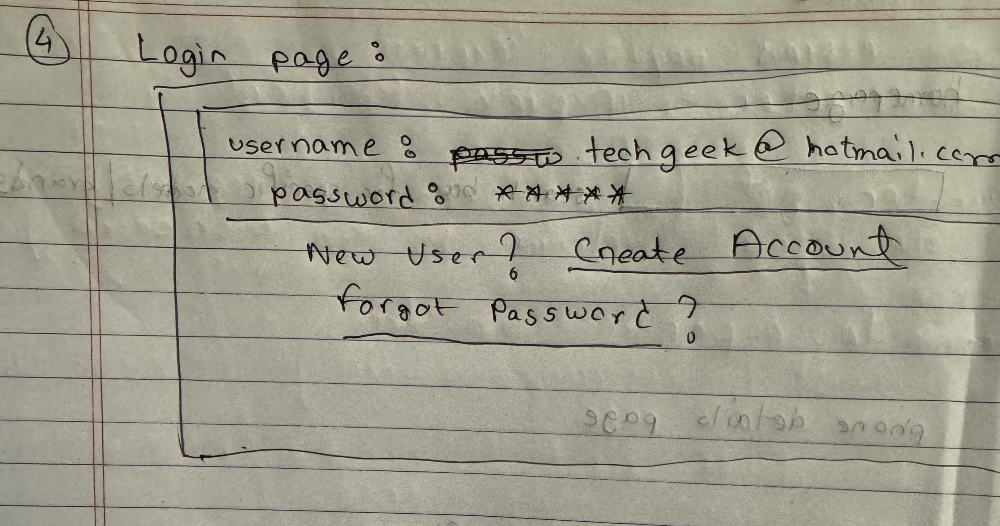
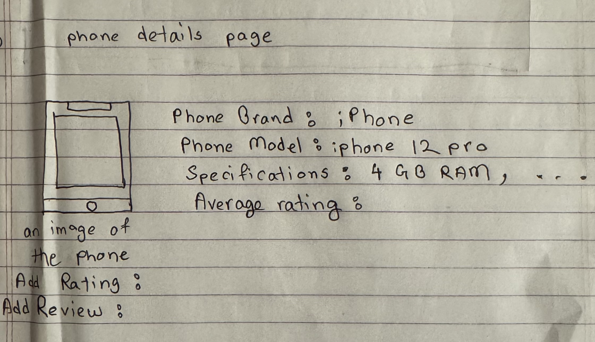
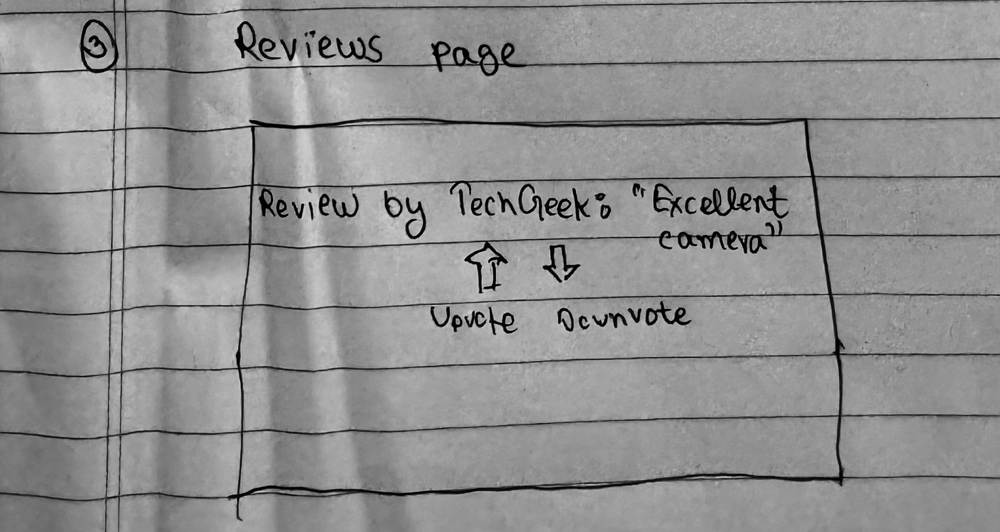

# SpecMyPhone

## Overview

Choosing a smartphone, tablet, or laptop involves navigating an array of features and specifications that can be overwhelming. SpecMyPhone aims to simplify this by allowing users to suggest and vote on features they would like to see in these devices. After registering and logging in, users can view various proposed features, upvote them, and even submit their own ideas.

## Data Model

The application will store Users, Phones, and Reviews.

- Users can save multiple phones to their favorites.
- Each phone can have multiple reviews.

An Example User:

```javascript
{
  "username": "TechGeek123",
  "hash": "a_password_hash",
  "savedPhones": // an array of references to Phone documents
}
```

An Example List with Embedded Items:

```javascript
{
  "brand": "Apple",
  "model": "iPhone 13",
  "specs": {
    "screenSize": "6.1 inches",
    "battery": "3200 mAh",
    ...
  },
  "reviews": [
    { "user": "techgeek123", "rating": 5, "comment": "Loved the camera!"},
    ...
  ],
  "createdAt": // timestamp
}

```

## [Link to Commented First Draft Schema](db.mjs)

Permalink to First Draft Schema(db.mjs) [https://github.com/nyu-csci-ua-0467-001-002-fall-2023/final-project-abdur-png/blob/de3e7c53460a8f87c15fbb57b1881dad3b52876c/db.mjs]

Path to First Draft Schema(db.mjs)[db.mjs]

## Wireframes

/list/create - home page



/list - login page



/list - phone details page



/list/slug - reviews page



## Site map

Home Page Description:
The landing page with an overview of "SpecMyPhone" and its features.
Links to:
Login
Register
Browse Specs (for non-registered users)

Login Page Description:
Where existing users can enter their credentials to log in.
Links to:
Home Page (if user chooses not to login)
Register (if a user doesn't have an account)

Register Page Description:
New users can create an account.
Links to:
Home Page (if user chooses not to register)
Login (for existing users)

Add New Phone Review Page Description:
A form where users can input and save reviews for a phone model.
Links to:
User Dashboard (upon saving or if user chooses to go back without adding)

Individual Phone Review Page Description:
Detailed view of specific phone specs where users can rate, edit, or share their reviews.
Links to:
User Dashboard (via navigation bar or after making modifications)
Comparison Page (if a user wants to compare specs with another phone)

## User Stories or Use Cases

As a non-registered user, I can:

1. Register a new account with the site.
2. View the homepage with a list of phones.
3. View individual phone details without the option to review or add to favorites.
4. Access the login page.

As a user, I can:

1. Log in to the site.
2. View the homepage with a list of phones.
3. View details of individual phones.
4. Remove a phone from my favorites.
5. Write a review for a specific phone.
6. Edit or delete my review for a specific phone.
7. Upvote or downvote reviews

## Research Topics

Perform client-side form validation using custom JavaScript or JavaScript library:

1. Utilize React's controlled components for form inputs to ensure that the state always represents the input value.
2. Incorporate custom JavaScript validation functions that check form inputs, such as email format, password strength, or phone model uniqueness.
3. Integrate libraries like react-hook-form or formik to handle complex validation and form management seamlessly.

Errors must be integrated into the DOM:

1. Display form validation errors directly in the UI, right below the associated input field.
2. Utilize React's conditional rendering to display error messages only when there's a validation error for a specific input field.
3. Ensure that errors are not only clear and descriptive but also accessible for screen readers and compliant with web accessibility standards.

Use a CSS framework or UI toolkit, with a reasonable amount of customization of the framework (don't just use stock Bootstrap - minimally configure a theme):

1. Bootstrap: Integrate Bootstrap with React using the react-bootstrap library for a seamless experience. Customize Bootstrap's default theme using SCSS variables to reflect the unique branding of "SpecMyPhone".
2. Enhance the user interface with Bootstrap's responsive grid system, ensuring the website is mobile-friendly and looks great on devices of all sizes.
3. For dynamic UI components, utilize React-Bootstrap components like Modals, Dropdowns, and Alerts to keep the consistency of the UI and ensure better integration with the React lifecycle.

## [Link to Initial Main Project File](app.mjs)

Link to project file [https://github.com/nyu-csci-ua-0467-001-002-fall-2023/final-project-abdur-png.git]

## Annotations / References Used
