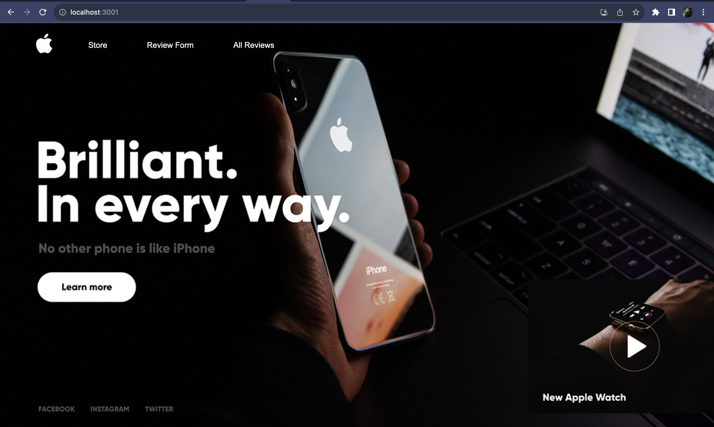

# BitelessApple

## Overview

In the digital age where choices are vast, the need for clear and accessible reviews is more pronounced than ever. BitelessApple serves this very purpose for tech enthusiasts. This web application allows users to share their insights on the latest apple devices, creating a community-driven platform for tech reviews. Users can submit detailed feature requests and ratings for their favorite devices, contributing to a comprehensive database of user-generated reviews.

## Data Model

The application will store Devices and Reviews:

- Users can post multiple reviews (one-to-many relationship)
- Each review is associated with a specific device (many-to-one relationship)

An Example Device:

```javascript
{
  "deviceName": "iPhone 15 Pro Max",
  "manufacturer": "Apple",
  "reviews": ["array of references to Review documents"]
}
```

An Example Review:

```javascript
{
  "user": "reference to a User object",
  "device": "reference to a Device object",
  "rating": 5,
  "comment": "The new camera is revolutionary!",
  "createdAt": "timestamp"
}

```

## Wireframes

/list/create - home page



/list - review-form


/list - phone review page


/list - all-reviews


## Site map

/list - sitemap


1. Home Page (/list/create): This is the landing page where users can navigate to the review form to write a review, or view all reviews. It acts as the central hub for the application.
2. Review Form (/list): A page where users can fill out a form to submit their review for a particular device. After submitting a review, they can return to the home page or go to the 'All Reviews' page to see all submissions.
3. All Reviews (/list): This page lists all devices that have been reviewed. Users can click on a device to read all reviews related to it.
4. Individual Phone Review Page (/list/slug): A dedicated page for each device where users can read all the reviews for that specific device. The 'slug' in the URL would be replaced by a unique identifier for each device, such as 'iPhone-15-Pro'.

## User Stories or Use Cases

1. As a new visitor, I will be able to understand the purpose of the app upon landing on the homepage.
2. As a user, I will be able to easily navigate from the homepage to the review form, so that I can quickly start writing a review.
3. As a user, I will be able to be able to choose a device from a dropdown list on the review form, so that I can categorize my review correctly.
4. As a user, I will be able to rate a device and write a detailed review, so that I can share my opinions and experiences with other users.
5. As a user, I will be able to view all my submitted reviews on the review form page after submission, so that I can confirm my review has been posted.
6. As a user, I will be able to see a list of all devices that have been reviewed on the 'All Reviews' page, so that I can browse reviews from other users.
7. As a user, when I click on a device name on the 'All Reviews' page, I will be able to see all the reviews for that specific device, so that I can understand what others think about it.
8. As a user, I will be able to search through the comments on the device review page to find specific information, so that I can quickly find the most relevant reviews.
9. As a user, I will be able to see an average rating and the most requested features on the device review page, so that I can get a quick overview of user opinions.
10. As a potential reviewer, I will be able to access the review form from any page, so that I can start writing a review at any moment.
11. As a user, I will be able to be able to navigate back to the homepage from any page, so that I can start a new task without using the browser's back button.


Link to project file [https://github.com/nyu-csci-ua-0467-001-002-fall-2023/final-project-abdur-png.git]

## Annotations / References Used

1. React documentation for building the UI [https://www.youtube.com/watch?v=SqcY0GlETPk&t=725s]
